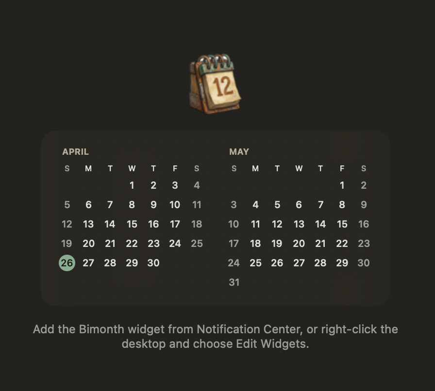

# Bimonth

A macOS desktop bimonthly-calendar widget. Shows two months side by side and shifts the displayed range based on the current date so you can see both "the recent past" and "the upcoming future" at a glance.




Full spec: [`docs/spec.md`](docs/spec.md).

## Display range

| Condition | Left month | Right month |
|-----------|------------|-------------|
| Day 1–6   | Previous   | Current     |
| Day 7–31  | Current    | Next        |

## Requirements

- macOS 14 (Sonoma) or later
- Xcode 16 or later (unit tests use Swift Testing)
- [xcodegen](https://github.com/yonaskolb/XcodeGen) (`brew install xcodegen`)

## First-time setup

1. Edit `project.yml` and replace every occurrence of `com.example` with your own reverse-DNS prefix (the `bundleIdPrefix` plus the three `PRODUCT_BUNDLE_IDENTIFIER` values), so Xcode can sign the targets against your Apple ID.
2. Generate the Xcode project and open it:

   ```bash
   cd path/to/bimonth
   xcodegen generate
   open Bimonth.xcodeproj
   ```

3. On first launch, Xcode prompts for a Development Team for both targets (`Bimonth` and `BimonthWidget`); a personal Apple ID works.

## Running the widget

1. In Xcode, select the `Bimonth` scheme and Build & Run (this launches the container app).
2. Right-click the desktop → Edit Widgets → find `Bimonth` → drag it onto the desktop or Notification Center.

## Running unit tests

```bash
xcodebuild test -project Bimonth.xcodeproj -scheme Bimonth -destination 'platform=macOS'
```

Or press ⌘U in Xcode.

## Project layout

```
bimonth/
├── project.yml                     # xcodegen config; .xcodeproj is generated from this
├── Bimonth/                        # Container app (minimal — exists only to host the widget extension)
│   ├── BimonthApp.swift
│   ├── ContentView.swift
│   ├── Bimonth.entitlements
│   └── Assets.xcassets/
├── BimonthWidget/                  # Widget extension (the widget itself)
│   ├── BimonthWidgetBundle.swift   # @main WidgetBundle
│   ├── BimonthWidget.swift         # Widget configuration
│   ├── Provider.swift              # TimelineProvider
│   ├── CalendarEntry.swift         # TimelineEntry model
│   ├── Info.plist
│   ├── BimonthWidget.entitlements
│   ├── Logic/
│   │   └── MonthResolver.swift     # Pure function deciding which two months to show
│   ├── Views/
│   │   ├── CalendarWidgetView.swift
│   │   ├── MonthView.swift
│   │   └── DayCell.swift
│   └── Assets.xcassets/
└── BimonthTests/
    └── MonthResolverTests.swift    # Edge-case coverage for MonthResolver
```

## Contributing

Issues and pull requests are welcome. Please read [`docs/spec.md`](docs/spec.md) first so changes stay aligned with the design intent.

## License

[MIT](LICENSE) © Hana Chang
